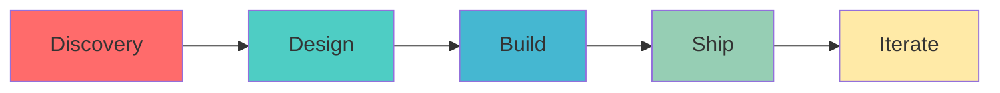

<div align="center">

# ⚡ TEAM ZEMO

### *Where Ideas Transform Into Reality*

[](https://github.com/TeamZemo)
[](https://github.com/TeamZemo)

*Building MVPs • Shipping Products • Creating Impact*

[Explore Projects](#-featured-projects) • [Join Team](#-join-the-crew) • [Hire Us](#-work-with-us)

</div>

---

## 🎯 Mission Control

We're not just another dev team—we're **builders, innovators, and problem solvers** who turn coffee into code and ideas into shipping products.

```typescript
const teamZemo = {
  mission: "Transform ambitious ideas into production-ready solutions",
  approach: "Fast iteration • Clean code • Real impact",
  vibe: "Professional execution meets creative chaos"
};
```

### What Makes Us Different

<table>
<tr>
<td width="33%" align="center">

### ⚡ Lightning Fast
MVP to production in weeks, not months

</td>
<td width="33%" align="center">

### 🎨 Built Different
Commercial-grade quality with startup energy

</td>
<td width="33%" align="center">

### 🤝 Community First
Your ideas fuel our projects

</td>
</tr>
</table>

---

## 🛠️ What We Build

<details open>
<summary><b>🚀 Community MVPs</b></summary>
<br>

Got a killer app idea? We might just build it. Submit your concept and watch the magic happen.

**Recent Builds:** SaaS Starters • Dev Tools • Web3 Apps • AI Experiments

</details>

<details>
<summary><b>💼 Commercial Projects</b></summary>
<br>

Full-stack development, API design, mobile apps, and custom solutions for businesses that value speed and quality.

**Tech Stack:** React • Next.js • Node.js • Python • Cloud Architecture

</details>

<details>
<summary><b>🌱 Open Source</b></summary>
<br>

Contributing to the ecosystem that raised us. From small utilities to full-fledged frameworks.

**Focus Areas:** Developer Tools • Templates • Libraries

</details>

---

## 👥 Meet The Crew

<div align="center">

| Role | Member | Superpower |
|:-----|:-------|:-----------|
| 🎯 Co-Founder | [@tanishqtiwari7](https://github.com/tanishqtiwari7) | UI/UX |
| 🎯 Co-Founder | [@UdayKhare09](https://github.com/UdayKhare09) | Devops  |
| 🎯 Co-Founder | [@Surendra1341](https://github.com/Surendra1341) | Backend Maestro |
| 🎯 Co-Founder | [@Yadveer1](https://github.com/Yadveer1) | Frontend Craftsman |

</div>

---


## 🤝 Join The Crew

We're always looking for passionate builders who want to create impact. Whether you're a seasoned dev or just getting started, there's a place for you here.

### We Value

- 🔥 **Passion** over perfection
- 🧠 **Learning** over knowing everything
- 🚀 **Shipping** over endless planning
- 💬 **Communication** over solo coding
- 🎯 **Impact** over busy work

### How to Join

```bash
# Step 1: Pick a project that excites you
# Step 2: Open an issue or PR
# Step 3: Join our community discussions
# Step 4: Ship something awesome together
```

**Ready?** → [Open an Issue](https://github.com/TeamZemo/TeamZemo/issues/new) or DM any founder

---

## 💼 Work With Us

Need a product built? Want to turn your idea into reality? We deliver commercial-grade solutions with startup speed.

### Our Process



**Start a Conversation** → [Reach Out](mailto:your-email@example.com) or open a [project inquiry](https://github.com/TeamZemo/TeamZemo/issues/new?template=project-inquiry.md)

---

## 📊 Stats & Activity

<div align="center">


**Active Contributors:** 12+ | **Projects Shipped:** 15+ | **Lines of Impact:** 500K+

</div>

---

## 🌐 Connect With Us

<div align="center">

[](https://github.com/TeamZemo)
[](https://twitter.com/TeamZemo)
[](https://discord.gg/your-invite)
[](mailto:your-email@example.com)

</div>

---

<div align="center">

### ⚡ *"Build together. Ship legendary products."*

**Made with 💜 by Team Zemo**

[⬆ Back to Top](#-team-zemo)

</div>
